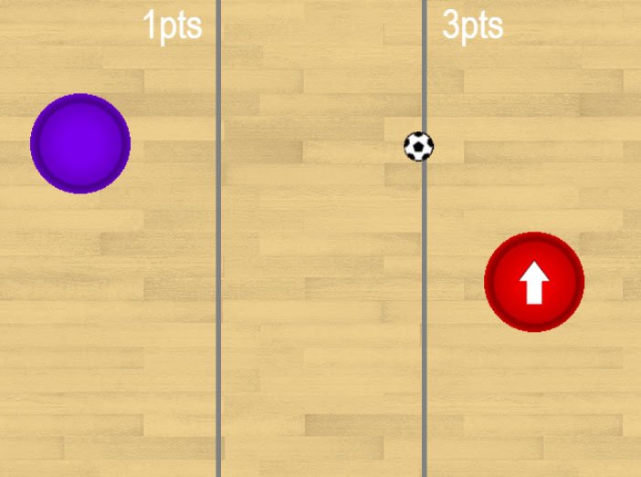
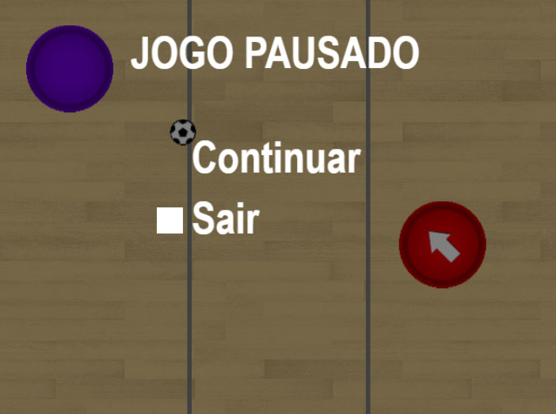

# GDS1-Javascript <a href="https://algol.dev" target="_blank"> </a>

Códigos dos capítulos do livro "Game Dev Series vol.01" - versão Javascript.<br>
Para obter mais informações sobre o livro [clique aqui](https://algol.dev/livros/gds1/).

Cada uma das pastas contém o projeto pronto de cada um dos capítulos do livro.

## Ilustrações do jogo em execução



## Dependêcias

* Nenhuma. Utiliza apenas ```HTML``` e ```Javascript```.
* Todos os algoritmos (detecção de colisões, cálculos de ângulos e deslocamento, carregamento e recorte das imagens, Inteligencia Artificial) são desenvolvidos em código ```Javascript```.

## Execução do Jogo

* Execute diretamente o arquivo ```index.html``` em qualquer navegador web.

## Author

Almir David Valente Santiago [@david_v_santiago](https://linktr.ee/david.santiago)
